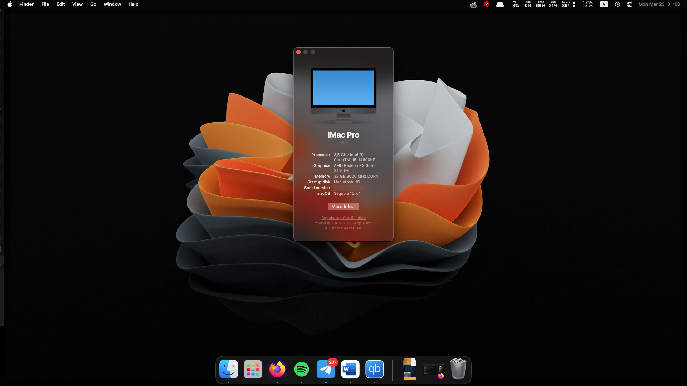
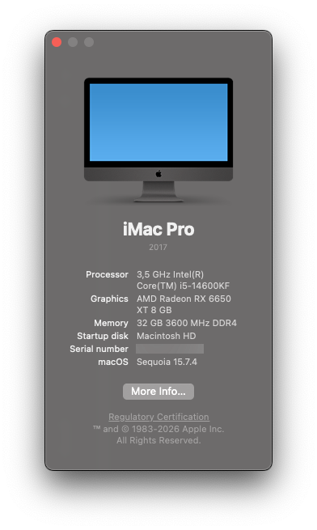
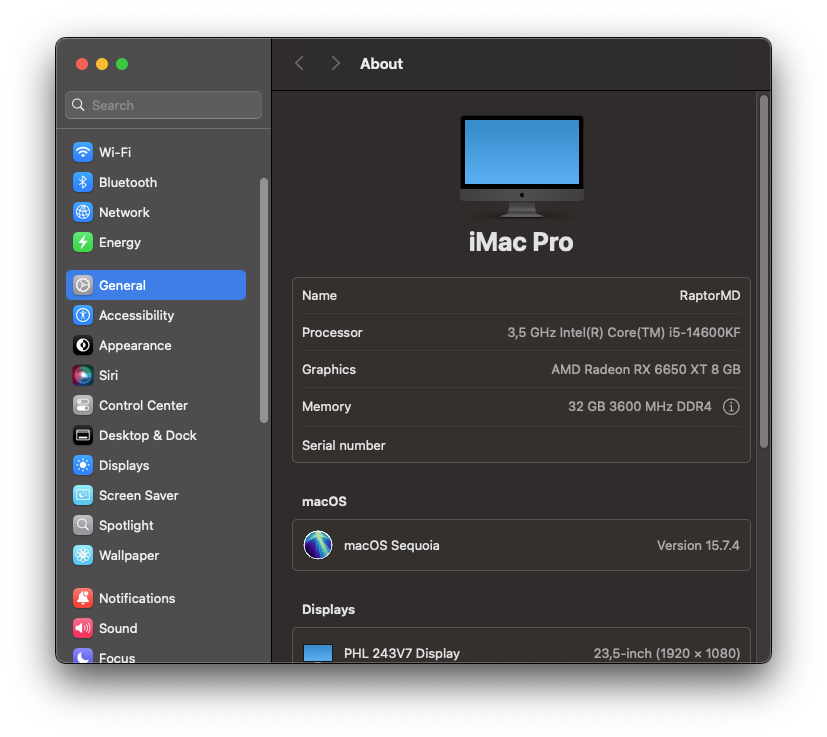
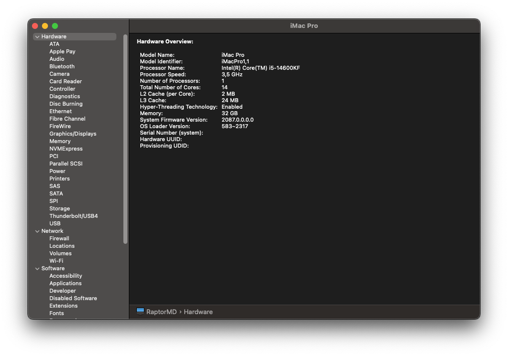
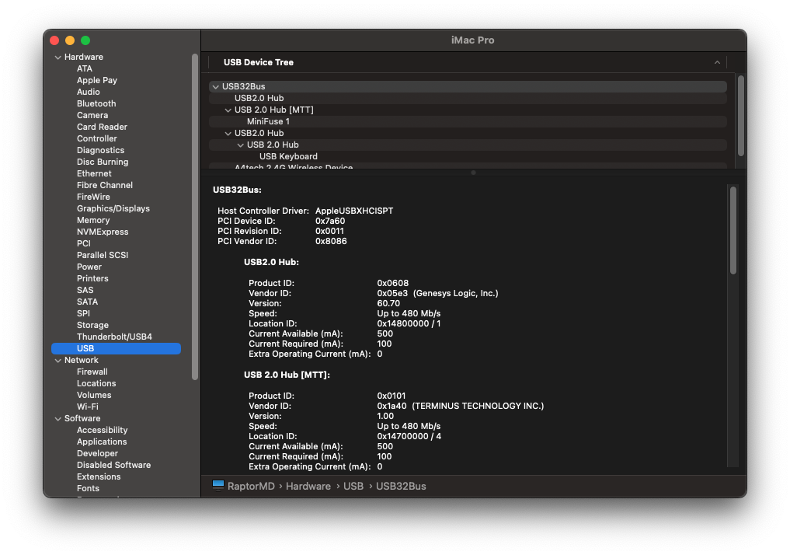
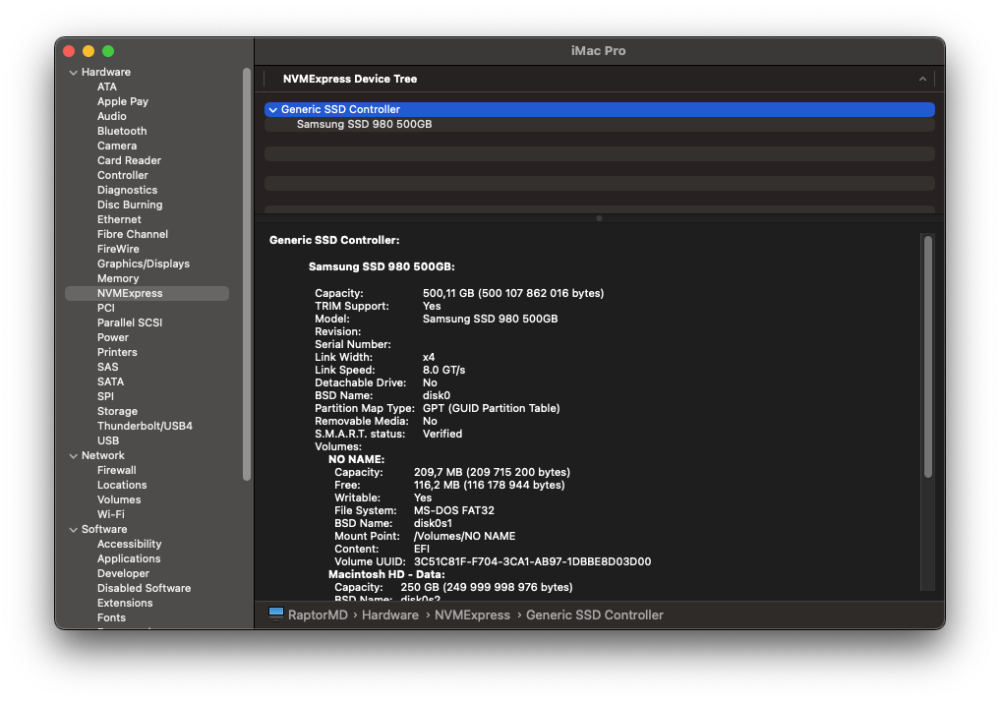
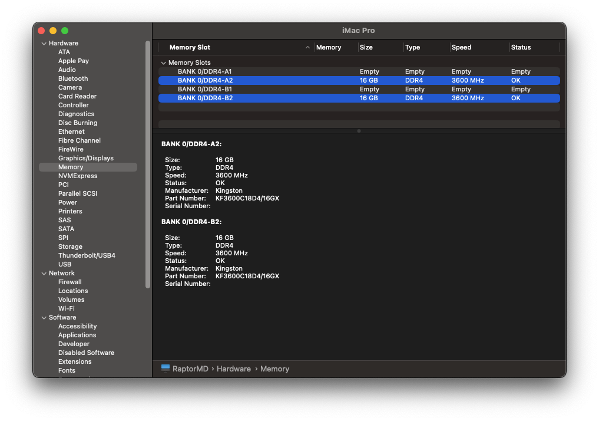
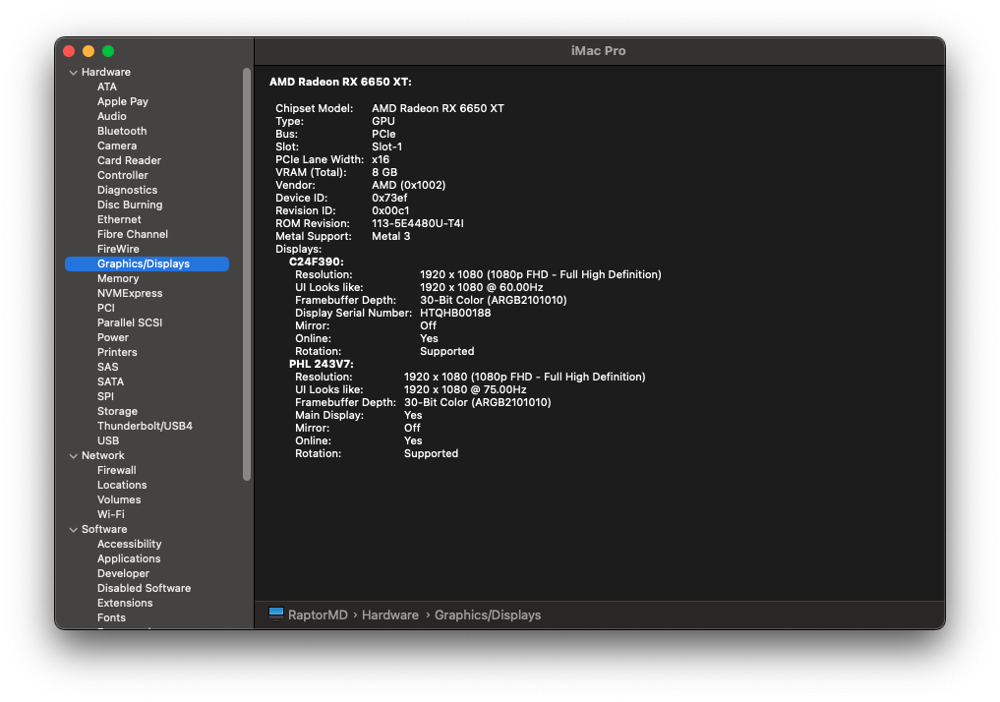

<h1 align="center">OpenCore B760 (Raptor Lake)</h1>

OpenCore Hackintosh configuration example for the <b>Gigabyte B760 Gaming X DDR4 GEN5</b> motherboard with an Intel® Core™ i5-14600KF.

  
  
  
  

 

<i>macOS Sequoia running on native hardware.</i>

 

***

## OpenCore

<h3>OpenCore 1.0.7</h3>

This is the version of OpenCore used, including bundled files. The included ``config.plist`` targets this version.
 

## macOS

<h3>macOS Sequoia 15.7.4</h3>

This is the version of macOS that this OpenCore configuration targets and has been tested on. Other versions have not been verified. 

 

***

## What works?

### macOS

- [x] Sequoia 15.7.4

### Hardware

- [x] Dedicated GPU (AMD Radeon RX 6650 XT)
- [ ] ~~iGPU~~ *(i5-14600KF has no integrated graphics)*
- [x] NVMe drives
- [x] SATA drives
- [x] USB 3.1 (XHCI)
- [x] Ethernet
- [ ] Wi-Fi *(no hardware)*
- [ ] Bluetooth *(no hardware)*
- [ ] Camera *(no hardware)*
- [x] Sound (ALC897 — front + rear jacks, digital out)

### Software

- [ ] AirDrop *(requires Wi-Fi + Bluetooth)*
- [x] iMessage
- [x] FaceTime
- [ ] Unlock with Apple Watch *(requires Bluetooth)*
- [x] QE/CI graphics acceleration
- [x] Metal support
- [x] Temperature sensors
- [x] Sleep / Wake
- [x] RTC
- [x] Hyperthreading
- [x] Virtualisation (VMM stub via RestrictEvents)
- [x] FileVault

 

***

## Problems

<ul>
<li><b>Wi-Fi and Bluetooth are unavailable</b></li>
No wireless card is installed in this system. AirDrop, Sidecar, AirPlay to Mac, Universal Control, and Unlock with Apple Watch do not work as a result.

 

<li><b>DRM content fails in Safari</b></li>
Apple TV+, Netflix in Safari, and other DRM-protected streams fail because <code>SecureBootModel</code> must be set to <code>Disabled</code> for this unsupported CPU. Use a Chromium-based browser as a workaround.

</ul>

***

## System

The specs of the main system that the OpenCore configuration targets.

| **Motherboard** |               Gigabyte B760 Gaming X DDR4 GEN5                |
|-----------------|:-------------------------------------------------------------:|
| **CPU**         |                  Intel® Core™ i5-14600KF                      |
| **Chipset**     |                          Intel B760                           |
| **Generation**  |                  Raptor Lake (14th Gen)                       |
| **Memory**      |       Kingston Fury Beast 2×16 GB DDR4 @ XMP 3600 MHz CL18    |
| **Storage**     |                Samsung SSD 980 500 GB NVMe                    |
| **GPU**         |         Sapphire Nitro+ AMD Radeon RX 6650 XT (Navi 23)       |
| **NIC**         |              Realtek RTL8125D 2.5 GbE (onboard)               |

***

## ACPI

SSDTs used (compiled from source via [SSDTTime](https://github.com/corpnewt/SSDTTime)):

- SSDT-EC
- SSDT-PLUG-ALT
- SSDT-RTCAWAC
- SSDT-SBUS
- SSDT-SBUS-MCHC
- SSDT-USB-Reset
- SSDT-USBX

***

## DeviceProperties

The following tables display the added PCI devices and their child keys.

### PciRoot(0x0)/Pci(0x1f,0x3)

Apple ALC — audio controller (HDA)

| **Key**   | **Type** | **Value** |
|-----------|:--------:|:---------:|
| layout-id |  Number  |    `12`   |

***

## Kernel

The following shows the kernel configuration.

### Kexts

Kexts used:

- [Lilu](https://github.com/acidanthera/Lilu) v1.7.2
- [VirtualSMC](https://github.com/acidanthera/VirtualSMC) v1.3.8
- [SMCProcessor](https://github.com/acidanthera/VirtualSMC) v1.3.8
- [SMCSuperIO](https://github.com/acidanthera/VirtualSMC) v1.3.8
- [AppleALC](https://github.com/acidanthera/AppleALC) v1.9.7
- [CpuTopologyRebuild](https://github.com/b00t0x/CpuTopologyRebuild) v2.0.2
- [LucyRTL8125Ethernet](https://github.com/Mieze/LucyRTL8125Ethernet) v1.2.3
- [NVMeFix](https://github.com/acidanthera/NVMeFix) v1.1.4
- [NootRX](https://github.com/ChefKissInc/NootRX) v1.0.0
- [RestrictEvents](https://github.com/acidanthera/RestrictEvents) v1.1.7
- [USBToolBox](https://github.com/USBToolBox/kext) v1.2.0
- [UTBMap](https://github.com/USBToolBox/kext) v1.1
- [XHCI-unsupported](https://github.com/RehabMan/OS-X-USB-Inject-All) v0.9.2

> [!WARNING]
> **`UTBMap.kext` is specific to this board and USB device configuration.** Even on the same motherboard, a different set of connected devices may require a different map. You must remap your own USB ports using [USBToolBox](https://github.com/USBToolBox/tool) and replace `UTBMap.kext` with your own.

> [!NOTE]
> **`layout-id: 12`** works for ALC897 on this specific board. If you have a different board with the same codec, you may need a different layout. Check the [AppleALC supported codecs list](https://github.com/acidanthera/AppleALC/wiki/Supported-codecs) for alternatives.

> [!NOTE]
> **`revcpuname`** in NVRAM is hardcoded to `Intel(R) Core(TM) i5-14600KF`. If you use a different CPU, update this value in `NVRAM → Add → 4D1FDA02`.

### Emulate

CPUID spoofing is required — the i5-14600KF (Raptor Lake Refresh) is not natively supported by macOS.

| **Key**              | **Type** |            **Value**             |
|----------------------|:--------:|:--------------------------------:|
| Cpuid1Data           |   Data   | `55060A000000000000000000000000` |
| Cpuid1Mask           |   Data   | `FFFFFFFF000000000000000000000000` |
| DummyPowerManagement |  Boolean | False                            |

### Patches

Three patches force Hyperthreading to remain enabled across all macOS versions on heterogeneous-core CPUs (i5-14600KF = 6 P-cores + 8 E-cores). All patches target `_cpu_thread_alloc` in `kernel`.

| **Comment**                                            | **MinKernel** | **MaxKernel** |
|--------------------------------------------------------|:-------------:|:-------------:|
| force HT enabled for Sequoia or later                  | 24.0.0        | *(any)*       |
| force HT enabled for Mojave to Sonoma                  | 18.0.0        | 23.99.99      |
| force HT enabled for High Sierra or earlier (untested) | 15.0.0        | 17.99.99      |

***

## Security

**SecureBootModel 》** Disabled

**Vault 》** Optional

**ScanPolicy 》** 0 *(scan all devices)*

**SIP (csr-active-config) 》** `0x0A03` — partially disabled (kext loading + debugging allowed)

***

## NVRAM

Contents stored in NVRAM.

 

### 4D1EDE05-38C7-4A6A-9CC6-4BCCA8B38C14

| **Key**                | **Type** |   **Value**  |
|------------------------|:--------:|:------------:|
| DefaultBackgroundColor |   Data   | ``00000000`` |

 

### 4D1FDA02-38C7-4A6A-9CC6-4BCCA8B30102

| **Key**       | **Type** |            **Value**           |
|---------------|:--------:|:------------------------------:|
| revcpu        |  Number  | `1`                            |
| revcpuname    |  String  | `Intel(R) Core(TM) i5-14600KF` |
| revpatch      |  String  | `sbvmm,cpuname`                |
| rtc-blacklist |   Data   | *(empty)*                      |

 

### 7C436110-AB2A-4BBB-A880-FE41995C9F82

| **Key**           | **Type** |   **Value**  |
|-------------------|:--------:|:------------:|
| boot-args         |  String  | *(empty)*    |
| csr-active-config |   Data   | ``030A0000`` |
| run-efi-updater   |  String  | `No`         |
| prev-lang:kbd     |   Data   | *(empty)*    |

***

## SMBIOS

### iMacPro1,1

The **iMacPro1,1** SMBIOS was chosen because:

- The i5-14600KF has **no integrated graphics** — SMBIOS models that expect an iGPU (iMac19,1, iMac20,x, MacPro7,1) cause issues
- iMacPro1,1 targets the Xeon W Skylake-SP platform — the closest Apple shipped to a high-core-count desktop without an iGPU dependency
- Full Metal / OpenCL / QE+CI support is enabled for discrete AMD GPUs without requiring `agdpmod=pikera`
- `UpdateSMBIOSMode = Custom` prevents SMBIOS injection into non-Apple OSes (Windows and Arch Linux share the same machine)

> [!IMPORTANT]
> The ``config.plist`` in this repository contains placeholder values in ``PlatformInfo → Generic``. You **must** generate your own SMBIOS with [GenSMBIOS](https://github.com/corpnewt/GenSMBIOS) before use. Never reuse serials found in public repos.

***

## BIOS Settings

Tested on Gigabyte B760 Gaming X DDR4 GEN5 (BIOS Version: F4).

### Tweaker

| **Setting** | **Value** |
|-------------|:---------:|
| Extreme Memory Profile (X.M.P.) | **Profile 1** — DDR4-3600 18-22-22-39-85-1.35V |
| CSM Support | **Disabled** |

### Settings → Miscellaneous

| **Setting** | **Value** |
|-------------|:---------:|
| Initial Display Output | PCIe 1 Slot |
| Above 4G Decoding | **Enabled** |
| Above 4GB MMIO BIOS assignment | **Enabled** *(required together with Re-Size BAR)* |
| Re-Size BAR Support | **Enabled** |
| VT-d | **Enabled** *(DisableIoMapper = false in config)* |
| VMD Controller | **Disabled** |

### Settings → USB Configuration

| **Setting** | **Value** |
|-------------|:---------:|
| Legacy USB Support | Enabled |
| XHCI Hand-off | **Enabled** |

### Boot

| **Setting** | **Value** |
|-------------|:---------:|
| CFG Lock | **Disabled** |
| Fast Boot | Disabled |
| CSM Support | **Disabled** |
| Windows 10 Features | **Other OS** |
| Secure Boot | Disabled |

***

## UEFI

Drivers in use:

- OpenRuntime.efi
- HfsPlus.efi
- OpenCanopy.efi
- OpenLinuxBoot.efi *(Arch Linux dual boot via Boot Loader Specification)*
- btrfs_x64.efi *(btrfs filesystem driver for OpenLinuxBoot)*
- ResetNvramEntry.efi

> [!NOTE]
> **`OpenLinuxBoot.efi` and `btrfs_x64.efi`** are only needed for Linux dual boot. If you run macOS only, set both to `Enabled: false` in ``config.plist`` or remove them from the Drivers list entirely.

> [!NOTE]
> **`ShowPicker`, `HideAuxiliary: false`, and `ScanPolicy: 0`** are configured for a multi-boot setup — the picker always shows and scans all drives. For a macOS-only install you may want `ShowPicker: false` (or a short `Timeout`) and a more restrictive `ScanPolicy`.

***

## Dual Boot

This EFI supports booting **macOS Sequoia**, **Arch Linux**, and **Windows 11** from a single OpenCore picker.

**Arch Linux** is loaded via EFISTUB using `OpenLinuxBoot.efi` + `btrfs_x64.efi`. A `loader/entries/arch.conf` file in the EFI partition root provides the boot entry per the [Boot Loader Specification](https://systemd.io/BOOT_LOADER_SPECIFICATION/). No GRUB required — kernel, initramfs, and microcode images live directly on the EFI partition.

**Windows 11** resides on a separate SSD. NTFS volumes (Windows SSD + storage HDD) are accessible from macOS via [Paragon NTFS](https://www.paragon-software.com/home/ntfs-mac/).

***

## Gallery

  
  

  
  

  
  

  

***

## Disclaimer

This EFI and configuration is provided as-is for informational and educational purposes. It was built for a specific hardware configuration and may require adjustments for your system. Always generate your own SMBIOS — never reuse serial numbers found in public repositories. The author takes no responsibility for any damage to hardware, data loss, or violation of Apple's macOS EULA.
